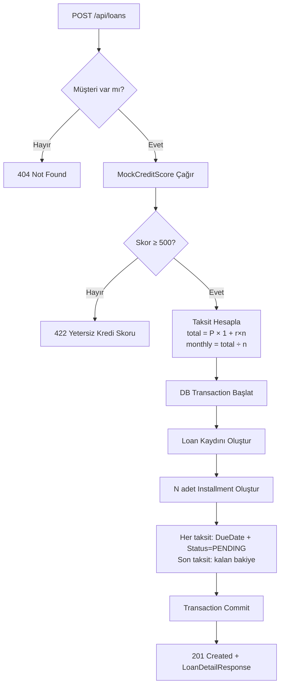

# Dijital Kredi ve Geri Ödeme Yönetim Sistemi — İmplementasyon Planı

> Case Study: Bankacılık Uygulamaları 2026  
> Hazırlayan: Claude Code (AI-assisted planning, human-reviewed)

---

## 1. Genel Bakış

### 1.1 Proje Amacı
Bireysel banka müşterilerinin kredi başvurusu yapabildiği, taksit planını görebildiği, ödeme yapabildği ve borç özetini takip edebildiği full-stack bankacılık uygulaması.

### 1.2 Teknoloji Seçimleri

| Katman | Teknoloji | Karar Gerekçesi |
|--------|-----------|----------------|
| Backend | .NET 8 (ASP.NET Core Web API) | Zorunlu şart; LTS sürüm |
| Frontend | React 18 + Vite | Zorunlu şart; hızlı scaffold |
| Database | Microsoft SQL Server 2022 | Case study zorunlu şartı |
| ORM | Entity Framework Core 8 | .NET ekosisteminin standart ORM'i; MSSQL desteği tam |
| Validation | FluentValidation | Zengin kural tanımı, temiz DTO validasyonu |
| HTTP Client | HttpClientFactory | Mock servis çağrıları için |
| API Docs | Swagger / Scalar | Endpoint dokümantasyonu |
| Git | GitHub | Commit geçmişi değerlendirme kriteri |

### 1.3 Mimari Karar: Orchestration / Business Ayrımlı Katmanlı Mimari

Clean Architecture yerine **Layered Architecture** tercih ediliyor; ancak `Application` katmanı içinde **Orchestration** ve **Business** olarak ikiye bölünüyor.

#### Neden bu ayrım?

| | Orchestration | Business |
|--|---------------|----------|
| Görevi | Akışı koordine eder | Kuralı hesaplar |
| Bağımlılıklar | Repository, dış servisler, DB transaction | Hiçbiri — saf C# |
| Test etmek | Integration test gerektirir | Mock olmadan unit test |
| Örnek | `LoanOrchestrator.CreateAsync()` | `InstallmentCalculator.Calculate()` |

**Somut fayda:** `InstallmentCalculator` veya `CreditEligibilityChecker` gibi sınıflar hiçbir dependency almaz; hesaplama sonucu doğrudan `Assert` edilebilir. Orchestrator ise repo ve dış servis çağrılarını koordine eder ama hesaplama detayını bilmez.

```
┌─────────────────────────────────────────────────────────┐
│  LoanManagement.API          Controllers · DTOs · MW    │
├─────────────────────────────────────────────────────────┤
│  LoanManagement.Application                             │
│    ├── Orchestration   akış + koordinasyon              │
│    │     LoanOrchestrator, PaymentOrchestrator          │
│    └── Business        saf hesaplama + kurallar         │
│          InstallmentCalculator, CreditEligibility...    │
├─────────────────────────────────────────────────────────┤
│  LoanManagement.Domain       Entities · Enums           │
├─────────────────────────────────────────────────────────┤
│  LoanManagement.Infrastructure  EF Core · Repos · Ext  │
└─────────────────────────────────────────────────────────┘
```

Çağrı yönü: `Controller → Orchestrator → Business (saf) + Repository + ExternalService`

---

## 2. Veri Modeli (ER Tasarımı)

### 2.1 Entity İlişkileri

```
Customer (1) ──────< Loan (many)
Loan     (1) ──────< Installment (many)
Installment (1) ───── Payment (0..1)   ← bir taksite en fazla bir ödeme
```

### 2.2 Tablo Şemaları (MSSQL)

#### Customers
```sql
CREATE TABLE Customers (
    Id          UNIQUEIDENTIFIER PRIMARY KEY DEFAULT NEWSEQUENTIALID(),
    FirstName   NVARCHAR(100)  NOT NULL,
    LastName    NVARCHAR(100)  NOT NULL,
    Email       NVARCHAR(200)  NOT NULL,
    Phone       NVARCHAR(20)   NULL,
    TcNo        NVARCHAR(11)   NOT NULL,
    BirthDate   DATE           NOT NULL,
    Address     NVARCHAR(MAX)  NULL,
    CreatedAt   DATETIME2      NOT NULL DEFAULT GETUTCDATE(),
    UpdatedAt   DATETIME2      NOT NULL DEFAULT GETUTCDATE(),
    IsDeleted   BIT            NOT NULL DEFAULT 0,

    CONSTRAINT UQ_Customers_Email UNIQUE (Email),
    CONSTRAINT UQ_Customers_TcNo  UNIQUE (TcNo)
);
```

#### Loans
```sql
CREATE TABLE Loans (
    Id              UNIQUEIDENTIFIER PRIMARY KEY DEFAULT NEWSEQUENTIALID(),
    CustomerId      UNIQUEIDENTIFIER NOT NULL REFERENCES Customers(Id),
    LoanType        NVARCHAR(20)     NOT NULL,   -- IHTIYAC | EGITIM | TASIT
    Principal       DECIMAL(18,2)    NOT NULL,   -- ana para
    InterestRate    DECIMAL(7,6)     NOT NULL,   -- kar oranı (örn: 0.018500 = %1.85/ay)
    TermMonths      INT              NOT NULL,   -- vade (ay)
    TotalAmount     DECIMAL(18,2)    NOT NULL,   -- toplam geri ödeme
    MonthlyPayment  DECIMAL(18,2)    NOT NULL,   -- aylık taksit
    StartDate       DATE             NOT NULL,
    Status          NVARCHAR(20)     NOT NULL DEFAULT 'ACTIVE', -- ACTIVE | CLOSED
    CreditScore     INT              NULL,       -- kredi skoru (mock servisden)
    CreatedAt       DATETIME2        NOT NULL DEFAULT GETUTCDATE()
);
```

#### Installments
```sql
CREATE TABLE Installments (
    Id              UNIQUEIDENTIFIER PRIMARY KEY DEFAULT NEWSEQUENTIALID(),
    LoanId          UNIQUEIDENTIFIER NOT NULL REFERENCES Loans(Id),
    InstallmentNo   INT              NOT NULL,   -- taksit numarası (1, 2, 3, ...)
    Amount          DECIMAL(18,2)    NOT NULL,   -- taksit tutarı
    DueDate         DATE             NOT NULL,   -- son ödeme tarihi
    Status          NVARCHAR(20)     NOT NULL DEFAULT 'PENDING',
    -- PENDING | PAID | OVERDUE
    CreatedAt       DATETIME2        NOT NULL DEFAULT GETUTCDATE(),

    CONSTRAINT UQ_Installments_LoanId_No UNIQUE (LoanId, InstallmentNo)
);
```

#### Payments
```sql
CREATE TABLE Payments (
    Id              UNIQUEIDENTIFIER PRIMARY KEY DEFAULT NEWSEQUENTIALID(),
    InstallmentId   UNIQUEIDENTIFIER NOT NULL REFERENCES Installments(Id),
    AmountPaid      DECIMAL(18,2)    NOT NULL,
    PaidAt          DATETIME2        NOT NULL DEFAULT GETUTCDATE(),
    PaymentRef      NVARCHAR(100)    NULL,   -- mock payment gateway referans kodu
    GatewayStatus   NVARCHAR(20)     NOT NULL DEFAULT 'SUCCESS',
    -- SUCCESS | FAILED

    CONSTRAINT UQ_Payments_InstallmentId UNIQUE (InstallmentId)
    -- Bir taksite yalnızca bir ödeme — DB seviyesinde garanti
);
```

### 2.3 MSSQL Bağlantı Dizesi (appsettings.json)

```json
{
  "ConnectionStrings": {
    "Default": "Server=localhost,1433;Database=LoanManagementDb;User Id=sa;Password=YourStrong@Passw0rd;TrustServerCertificate=True;MultipleActiveResultSets=true"
  }
}
```

### 2.4 EF Core MSSQL Paketi

```bash
dotnet add package Microsoft.EntityFrameworkCore.SqlServer
dotnet add package Microsoft.EntityFrameworkCore.Tools
```

`AppDbContext.cs`:
```csharp
protected override void OnConfiguring(DbContextOptionsBuilder options)
    => options.UseSqlServer(connectionString);
```

### 2.5 Taksit Hesaplama Formülü

**Flat Rate (Düz Faiz) — Bankacılık case study için uygun:**

```
total_amount    = principal × (1 + interest_rate × term_months)
monthly_payment = total_amount / term_months
```

Örnek: 100.000 TL, %1.85/ay, 24 ay
- total = 100.000 × (1 + 0.0185 × 24) = 100.000 × 1.444 = 144.400 TL
- aylık = 144.400 / 24 = 6.016,67 TL

> **Not:** Son taksit yuvarlama farkını absorbe eder:  
> `lastInstallmentAmount = totalAmount - (monthlyPayment × (termMonths - 1))`

---

## 3. Proje Klasör Yapısı

```
Dijital-Kredi-Sistemi/
├── backend/
│   ├── LoanManagement.sln
│   ├── LoanManagement.API/
│   │   ├── Controllers/
│   │   │   ├── CustomersController.cs
│   │   │   ├── LoansController.cs
│   │   │   ├── InstallmentsController.cs
│   │   │   ├── PaymentsController.cs
│   │   │   └── SummaryController.cs
│   │   ├── DTOs/
│   │   │   ├── Customer/
│   │   │   │   ├── CreateCustomerRequest.cs
│   │   │   │   ├── UpdateCustomerRequest.cs
│   │   │   │   └── CustomerResponse.cs
│   │   │   ├── Loan/
│   │   │   │   ├── CreateLoanRequest.cs
│   │   │   │   ├── LoanResponse.cs
│   │   │   │   └── LoanDetailResponse.cs
│   │   │   ├── Installment/
│   │   │   │   └── InstallmentResponse.cs
│   │   │   └── Payment/
│   │   │       ├── CreatePaymentRequest.cs
│   │   │       └── PaymentResponse.cs
│   │   ├── Middleware/
│   │   │   └── GlobalExceptionMiddleware.cs
│   │   ├── appsettings.json
│   │   ├── appsettings.Development.json
│   │   └── Program.cs
│   │
│   ├── LoanManagement.Application/
│   │   ├── Interfaces/
│   │   │   ├── Orchestration/
│   │   │   │   ├── ILoanOrchestrator.cs
│   │   │   │   ├── IPaymentOrchestrator.cs
│   │   │   │   └── ICustomerOrchestrator.cs
│   │   │   └── External/                ← dış servis portları (Infrastructure implement eder)
│   │   │       ├── ICreditScoreService.cs
│   │   │       └── IPaymentGateway.cs
│   │   ├── Orchestration/               ← akış koordinasyonu, repo + dış servis bağımlılıkları var
│   │   │   ├── LoanOrchestrator.cs      ← credit score → business hesapla → kaydet → taksit üret
│   │   │   ├── PaymentOrchestrator.cs   ← validate → gateway → kaydet → loan status güncelle
│   │   │   ├── CustomerOrchestrator.cs  ← CRUD akışı
│   │   │   └── SummaryOrchestrator.cs   ← özet sorgulama
│   │   └── Business/                    ← saf hesaplama, SIFIR dış bağımlılık
│   │       ├── InstallmentCalculator.cs     ← flat-rate hesaplama + taksit listesi üretme
│   │       ├── CreditEligibilityChecker.cs  ← skor eşik kuralı (>= 500 mi?)
│   │       ├── PaymentValidator.cs          ← tutar eşleşme, duplicate ödeme kuralları
│   │       └── LoanStatusEvaluator.cs       ← tüm taksitler ödendi mi → CLOSED?
│   │
│   ├── LoanManagement.Domain/
│   │   ├── Entities/
│   │   │   ├── Customer.cs
│   │   │   ├── Loan.cs
│   │   │   ├── Installment.cs
│   │   │   └── Payment.cs
│   │   └── Enums/
│   │       ├── LoanType.cs           -- IHTIYAC, EGITIM, TASIT
│   │       ├── LoanStatus.cs         -- ACTIVE, CLOSED
│   │       └── InstallmentStatus.cs  -- PENDING, PAID, OVERDUE
│   │
│   └── LoanManagement.Infrastructure/
│       ├── Data/
│       │   ├── AppDbContext.cs
│       │   ├── Configurations/       ← EF Fluent API config (IEntityTypeConfiguration<T>)
│       │   │   ├── CustomerConfiguration.cs
│       │   │   ├── LoanConfiguration.cs
│       │   │   ├── InstallmentConfiguration.cs
│       │   │   └── PaymentConfiguration.cs
│       │   └── Migrations/
│       ├── Repositories/
│       │   ├── CustomerRepository.cs
│       │   ├── LoanRepository.cs
│       │   └── InstallmentRepository.cs
│       └── ExternalServices/
│           ├── MockCreditScoreService.cs   ← dış servis 1
│           └── MockPaymentGateway.cs       ← dış servis 2
│
├── frontend/
│   ├── src/
│   │   ├── api/           ← axios instance + typed API calls
│   │   ├── pages/
│   │   │   ├── Customers/
│   │   │   ├── Loans/
│   │   │   ├── Payments/
│   │   │   └── Summary/
│   │   ├── components/    ← paylaşılan UI bileşenleri
│   │   └── App.tsx
│   ├── package.json
│   └── vite.config.ts
│
├── docs/
│   ├── er-diagram.md
│   ├── api-endpoints.md
│   └── flow-diagram.md
│
└── README.md
```

---

## 4. API Endpoint Tasarımı

### 4.1 Customers

| Method | Path | Açıklama |
|--------|------|----------|
| `POST` | `/api/customers` | Yeni müşteri oluştur |
| `GET` | `/api/customers` | Tüm müşterileri listele |
| `GET` | `/api/customers/{id}` | Müşteri detayı |
| `PUT` | `/api/customers/{id}` | Müşteri güncelle |
| `DELETE` | `/api/customers/{id}` | Müşteri sil (soft delete) |

### 4.2 Loans

| Method | Path | Açıklama |
|--------|------|----------|
| `POST` | `/api/loans` | Kredi oluştur + taksit planı otomatik üret |
| `GET` | `/api/loans` | Tüm kredileri listele |
| `GET` | `/api/loans/{id}` | Kredi detayı (taksitlerle birlikte) |
| `GET` | `/api/customers/{customerId}/loans` | Müşterinin kredileri |
| `PATCH` | `/api/loans/{id}/status` | Kredi durumu güncelle (CLOSED) |

### 4.3 Installments

| Method | Path | Açıklama |
|--------|------|----------|
| `GET` | `/api/loans/{loanId}/installments` | Kredinin taksit planı |
| `GET` | `/api/installments/{id}` | Taksit detayı |
| `POST` | `/api/installments/check-overdue` | Gecikmiş taksitleri güncelle |

### 4.4 Payments

| Method | Path | Açıklama |
|--------|------|----------|
| `POST` | `/api/payments` | Taksit ödemesi yap |
| `GET` | `/api/payments/{id}` | Ödeme detayı |
| `GET` | `/api/loans/{loanId}/payments` | Kredi ödemeleri |

### 4.5 Summary

| Method | Path | Açıklama |
|--------|------|----------|
| `GET` | `/api/customers/{id}/summary` | Müşteri borç özeti |

**Summary Response Örneği:**
```json
{
  "customerId": "3fa85f64-5717-4562-b3fc-2c963f66afa6",
  "customerName": "Ahmet Yılmaz",
  "totalDebt": 144400.00,
  "remainingPrincipal": 87500.00,
  "overdueInstallmentCount": 2,
  "paidInstallmentCount": 8,
  "unpaidInstallmentCount": 14,
  "loans": []
}
```

### 4.6 Mock Dış Servisler

| Method | Path | Açıklama |
|--------|------|----------|
| `GET` | `/api/external/credit-score/{tcNo}` | Kredi skoru sorgula (mock) |
| `POST` | `/api/external/payment-gateway/process` | Ödeme işle (mock) |

---

## 5. Business Logic Detayları

### 5.1 Orchestration / Business Sorumluluk Dağılımı

```
LoanOrchestrator.CreateAsync(request)
    │
    ├─ [ORCHESTRATION] Müşteri var mı? → CustomerRepository.GetByIdAsync()
    ├─ [ORCHESTRATION] CreditScoreService.GetScoreAsync(tcNo) çağır
    │
    ├─ [BUSINESS] CreditEligibilityChecker.Check(score)
    │       → Skor < 500 → CreditEligibilityException fırlat
    │
    ├─ [BUSINESS] InstallmentCalculator.Calculate(principal, rate, term, startDate)
    │       → LoanCalculation { TotalAmount, MonthlyPayment, Installments[] } döner
    │
    ├─ [ORCHESTRATION] DB Transaction başlat
    ├─ [ORCHESTRATION] LoanRepository.AddAsync(loan)
    ├─ [ORCHESTRATION] InstallmentRepository.AddRangeAsync(installments)
    └─ [ORCHESTRATION] Transaction commit → LoanDetailResponse

PaymentOrchestrator.ProcessAsync(request)
    │
    ├─ [ORCHESTRATION] InstallmentRepository.GetByIdAsync()
    ├─ [BUSINESS] PaymentValidator.Validate(installment, amount)
    │       → PAID mı? → ConflictException
    │       → Tutar ±1 TL dışında mı? → ValidationException
    │
    ├─ [ORCHESTRATION] PaymentGateway.ProcessAsync(...)
    ├─ [ORCHESTRATION] PaymentRepository.AddAsync(payment)
    ├─ [ORCHESTRATION] Installment.Status = PAID
    ├─ [BUSINESS] LoanStatusEvaluator.ShouldClose(installments)
    │       → true ise: Loan.Status = CLOSED
    └─ [ORCHESTRATION] Transaction commit → PaymentResponse
```

### 5.2 Business Sınıfları — Kod Örnekleri

```csharp
// Application/Business/InstallmentCalculator.cs
// Hiçbir bağımlılık yok — new InstallmentCalculator() yeterli
public class InstallmentCalculator
{
    public LoanCalculation Calculate(
        decimal principal, decimal interestRate, int termMonths, DateOnly startDate)
    {
        var totalAmount    = principal * (1 + interestRate * termMonths);
        var monthlyPayment = Math.Round(totalAmount / termMonths, 2);

        var installments = Enumerable.Range(1, termMonths).Select(i =>
        {
            var amount = i < termMonths
                ? monthlyPayment
                : totalAmount - monthlyPayment * (termMonths - 1); // son taksit
            return new InstallmentLine(i, amount, startDate.AddMonths(i));
        }).ToList();

        return new LoanCalculation(totalAmount, monthlyPayment, installments);
    }
}

// Application/Business/CreditEligibilityChecker.cs
public class CreditEligibilityChecker
{
    private const int MinScore = 500;

    public void EnsureEligible(int score)
    {
        if (score < MinScore)
            throw new ValidationException(
                $"Yetersiz kredi skoru: {score}. Minimum {MinScore} gereklidir.");
    }
}

// Application/Business/PaymentValidator.cs
public class PaymentValidator
{
    public void Validate(Installment installment, decimal amountPaid)
    {
        if (installment.Status == InstallmentStatus.Paid)
            throw new ConflictException("Bu taksit zaten ödenmiştir.");

        if (Math.Abs(installment.Amount - amountPaid) > 1m)
            throw new ValidationException(
                $"Ödeme tutarı uyumsuz. Beklenen: {installment.Amount:F2} TL");
    }
}

// Application/Business/LoanStatusEvaluator.cs
public class LoanStatusEvaluator
{
    public bool ShouldClose(IEnumerable<Installment> installments)
        => installments.All(i => i.Status == InstallmentStatus.Paid);
}
```

### 5.3 Gecikmiş Taksit Güncelleme

```
POST /api/installments/check-overdue
    │
    └─ Tüm PENDING installment'lar için:
           if DueDate < DateTime.UtcNow.Date → Status = OVERDUE
```

Background job zorunlu değildir. Bu endpoint manuel tetiklenir (Swagger veya frontend butonu).

### 5.4 Validation Kuralları (FluentValidation)

**CreateLoanRequest:**
- `CustomerId`: zorunlu, geçerli GUID
- `LoanType`: zorunlu, [IHTIYAC, EGITIM, TASIT] içinde
- `Principal`: 1.000 ≤ değer ≤ 5.000.000
- `InterestRate`: 0.001 ≤ değer ≤ 0.10 (aylık %0.1 - %10)
- `TermMonths`: 3 ≤ değer ≤ 120 (3 ay - 10 yıl)
- `StartDate`: bugün veya ilerisi

**CreateCustomerRequest:**
- `FirstName`, `LastName`: zorunlu, max 100 karakter
- `Email`: geçerli email formatı, unique olması DB'de kontrol edilir
- `TcNo`: tam 11 hane, sayısal
- `BirthDate`: bugünden 18 yıl öncesi veya daha eski

---

## 6. Mock Dış Servisler

### 6.1 MockCreditScoreService

```csharp
// Infrastructure/ExternalServices/MockCreditScoreService.cs
public class MockCreditScoreService : ICreditScoreService
{
    public Task<CreditScoreResult> GetScoreAsync(string tcNo)
    {
        // TC'nin son hanesine göre deterministik skor — test edilebilir
        var lastDigit = int.Parse(tcNo[^1].ToString());
        var score = 300 + (lastDigit * 55); // 300–795 arası

        return Task.FromResult(new CreditScoreResult
        {
            TcNo       = tcNo,
            Score      = score,
            RiskLevel  = score >= 700 ? "LOW" : score >= 500 ? "MEDIUM" : "HIGH",
            QueriedAt  = DateTime.UtcNow
        });
    }
}
```

### 6.2 MockPaymentGateway

```csharp
// Infrastructure/ExternalServices/MockPaymentGateway.cs
public class MockPaymentGateway : IPaymentGateway
{
    public Task<PaymentGatewayResult> ProcessAsync(PaymentRequest request)
    {
        // Tutarın 7'ye bölünüp bölünmediğine göre başarı/başarısız simülasyonu
        var success = (int)request.Amount % 7 != 0;

        return Task.FromResult(new PaymentGatewayResult
        {
            Success       = success,
            ReferenceCode = success ? $"PAY-{Guid.NewGuid():N}"[..12].ToUpper() : null,
            FailureReason = success ? null : "Insufficient funds (simulated)",
            ProcessedAt   = DateTime.UtcNow
        });
    }
}
```

---

## 7. Exception Handling

### 7.1 Custom Exception Hiyerarşisi

```csharp
// Domain/Exceptions/
AppException              ← base (400)
├── NotFoundException     ← 404
├── ConflictException     ← 409 (zaten ödendi, duplicate email)
├── ValidationException   ← 422 (yetersiz kredi skoru, kural ihlali)
└── PaymentFailedException ← 402
```

### 7.2 Global Exception Middleware (RFC 7807 ProblemDetails)

```csharp
// Middleware/GlobalExceptionMiddleware.cs
// Tüm exception'ları yakalar → standart ProblemDetails döndürür
{
  "type":    "https://httpstatuses.io/404",
  "title":   "Not Found",
  "status":  404,
  "detail":  "Customer with id '...' not found.",
  "traceId": "..."
}
```

---

## 8. Frontend Sayfaları

### 8.1 Sayfa Listesi

| Sayfa | Route | İçerik |
|-------|-------|--------|
| Müşteriler | `/customers` | Tablo + ekle / düzenle / sil |
| Müşteri Detay | `/customers/:id` | Profil + kredi listesi + özet |
| Kredi Oluştur | `/loans/new` | Form (müşteri seç, kredi bilgileri) |
| Kredi Detay | `/loans/:id` | Taksit tablosu + ödeme butonları |
| Ödeme Yap | modal | Taksit seç, tutarı onayla, işlem yap |
| Borç Özeti | `/customers/:id/summary` | Toplam borç, gecikmiş taksitler |

### 8.2 Frontend Stack

- **React 18 + Vite + TypeScript**
- **React Router v6** — sayfa navigasyonu
- **Axios** — API çağrıları (`VITE_API_URL` env'den alır)
- **Tailwind CSS** — sade, hızlı stil

---

## 9. Docker Compose (Geliştirme Ortamı)

```yaml
# docker-compose.yml
services:
  mssql:
    image: mcr.microsoft.com/mssql/server:2022-latest
    environment:
      ACCEPT_EULA: "Y"
      SA_PASSWORD: "YourStrong@Passw0rd"
      MSSQL_PID: Developer
    ports:
      - "1433:1433"
    volumes:
      - mssql_data:/var/opt/mssql

  api:
    build: ./backend
    ports:
      - "5000:8080"
    environment:
      ConnectionStrings__Default: >
        Server=mssql,1433;Database=LoanManagementDb;
        User Id=sa;Password=YourStrong@Passw0rd;
        TrustServerCertificate=True;
      ASPNETCORE_ENVIRONMENT: Development
    depends_on:
      - mssql

  frontend:
    build: ./frontend
    ports:
      - "3000:3000"
    environment:
      VITE_API_URL: http://localhost:5000

volumes:
  mssql_data:
```

---

## 10. İmplementasyon Aşamaları

### Faz 1 — Backend Core (Gün 1-2)
- [ ] `dotnet new sln` + 4 proje scaffold
- [ ] NuGet paketleri ekle (`SqlServer`, `FluentValidation`, `Swashbuckle`)
- [ ] Domain entity'leri yaz (Customer, Loan, Installment, Payment + enum'lar)
- [ ] AppDbContext + EF Fluent API konfigürasyonları
- [ ] `dotnet ef migrations add InitialCreate` + `database update`
- [ ] Repository katmanı

### Faz 2 — Business + Orchestration Katmanları (Gün 2-3)

**Business (önce yaz — dependency yok, hızlı test edilir):**
- [ ] `InstallmentCalculator` — flat-rate hesaplama + son taksit yuvarlama
- [ ] `CreditEligibilityChecker` — skor eşik kuralı
- [ ] `PaymentValidator` — duplicate + tutar kontrolü
- [ ] `LoanStatusEvaluator` — tüm taksit ödendi mi?

**Orchestration (sonra yaz — repo + dış servis bağlar):**
- [ ] `CustomerOrchestrator` — CRUD + soft delete akışı
- [ ] `LoanOrchestrator` — credit score → Business hesapla → kaydet → taksit üret
- [ ] `PaymentOrchestrator` — validate → gateway → kaydet → status güncelle
- [ ] `SummaryOrchestrator` — özet sorgulama

### Faz 3 — Mock Servisler + API Katmanı (Gün 3)
- [ ] MockCreditScoreService + MockPaymentGateway
- [ ] GlobalExceptionMiddleware
- [ ] FluentValidation kuralları + DI kaydı
- [ ] 5 Controller yaz
- [ ] Swagger konfigürasyonu
- [ ] CORS policy (frontend localhost:3000)

### Faz 4 — Frontend (Gün 4)
- [ ] `npm create vite@latest` + React + TypeScript
- [ ] Axios API client (typed response'lar)
- [ ] Customers sayfası (CRUD)
- [ ] Loans sayfası (oluştur + detay + taksit tablosu)
- [ ] Ödeme modal'ı
- [ ] Summary sayfası

### Faz 5 — Dokümantasyon (Gün 5)
- [ ] ER Diyagram (Mermaid)
- [ ] API endpoint listesi (`docs/api-endpoints.md`)
- [ ] Kredi oluşturma akış diyagramı (`docs/flow-diagram.md`)
- [ ] README.md (kurulum adımları + AI kullanım bölümü)
- [ ] Git commit geçmişini anlamlı tutmak (her faz için ayrı commit)

---

## 11. Dokümantasyon Çıktıları

### 11.1 ER Diyagram (Mermaid)

```mermaid
erDiagram
    CUSTOMERS {
        uniqueidentifier Id PK
        nvarchar FirstName
        nvarchar LastName
        nvarchar Email UK
        nvarchar TcNo UK
        date BirthDate
        datetime2 CreatedAt
        bit IsDeleted
    }
    LOANS {
        uniqueidentifier Id PK
        uniqueidentifier CustomerId FK
        nvarchar LoanType
        decimal Principal
        decimal InterestRate
        int TermMonths
        decimal TotalAmount
        decimal MonthlyPayment
        date StartDate
        nvarchar Status
        int CreditScore
    }
    INSTALLMENTS {
        uniqueidentifier Id PK
        uniqueidentifier LoanId FK
        int InstallmentNo
        decimal Amount
        date DueDate
        nvarchar Status
    }
    PAYMENTS {
        uniqueidentifier Id PK
        uniqueidentifier InstallmentId FK UK
        decimal AmountPaid
        datetime2 PaidAt
        nvarchar PaymentRef
        nvarchar GatewayStatus
    }

    CUSTOMERS ||--o{ LOANS : "sahip olur"
    LOANS ||--|{ INSTALLMENTS : "üretir"
    INSTALLMENTS ||--o| PAYMENTS : "ödenir"
```

### 11.2 Kredi Oluşturma Akış Diyagramı



### 11.3 README.md AI Kullanım Bölümü (şablon)

```markdown
## 🤖 AI Kullanımı

Bu projede Claude Code (Anthropic) yapay zeka destekli geliştirme
yaklaşımı kullanılmıştır.

### Kullanım Alanları
- İmplementasyon planı ve proje iskelet taslağı
- Entity sınıfı ve DTO yapıları
- FluentValidation kural önerileri
- Exception handling middleware kodu
- Mock servis tasarımı

### Kontrol Süreci
- AI çıktıları doğrudan kullanılmadı; her üretilen kod incelendi
- Taksit hesaplama formülü ve ödeme akış mantığı manuel doğrulandı
- Validation limit değerleri (min tutar, max vade vb.) bilinçli belirlendi
- MSSQL'e özgü tip seçimleri (UNIQUEIDENTIFIER, DECIMAL, NVARCHAR) manuel düzenlendi
```

---

## 12. Değerlendirme Kriterlerine Karşılık

| Kriter | Nasıl Karşılanıyor |
|--------|-------------------|
| Bankacılık domain mantığı | Flat-rate hesaplama, kredi skoru kapısı, gecikme tespiti |
| Para & bakiye tutarlılığı | Son taksit yuvarlama, DB transaction, amount eşleşme kontrolü |
| Veri ilişkileri | EF Fluent API ile 1-N + 1-0..1; `UNIQUE` constraint on Payments |
| Kod okunabilirliği | Orchestration/Business ayrımı, tek sorumluluk, DTO/Entity ayrımı |
| API tasarımı | RESTful, resource-based URL, HTTP semantiği (201/404/409/422) |
| Dokümantasyon | ER diyagram + flow + endpoint listesi + README |
| Mock servis entegrasyonu | 2 servis: CreditScore + PaymentGateway |

---

## 13. Kritik Dikkat Noktaları

1. **Son taksit yuvarlama**: `totalAmount - (monthlyPayment * (termMonths - 1))` ile hesaplanmalı, kümülatif kuruş hatası birikmemeli.

2. **Duplicate payment koruması**: `Payments.InstallmentId UNIQUE` → DB constraint seviyesinde garanti, servis katmanında da `PAID` check.

3. **Soft delete**: `IsDeleted = 1` olan müşteri sorguları filtrele (`HasQueryFilter` EF Core ile global filter eklenebilir).

4. **MSSQL NEWSEQUENTIALID()**: `NEWID()` yerine NEWSEQUENTIALID kullan — clustered index fragmentation'ı önler.

5. **InterestRate storage**: `DECIMAL(7,6)` → `0.018500` olarak sakla, `%1.85` değil. Response DTO'da her iki format döndürülebilir.

6. **CORS**: `localhost:3000` (frontend) için API'da CORS policy açık olmalı; production'da kısıtlanmalı.

7. **Migration ilk çalıştırma**: `dotnet ef database update` veya Program.cs'de `app.MigrateDatabase()` extension method ile auto-migrate.
